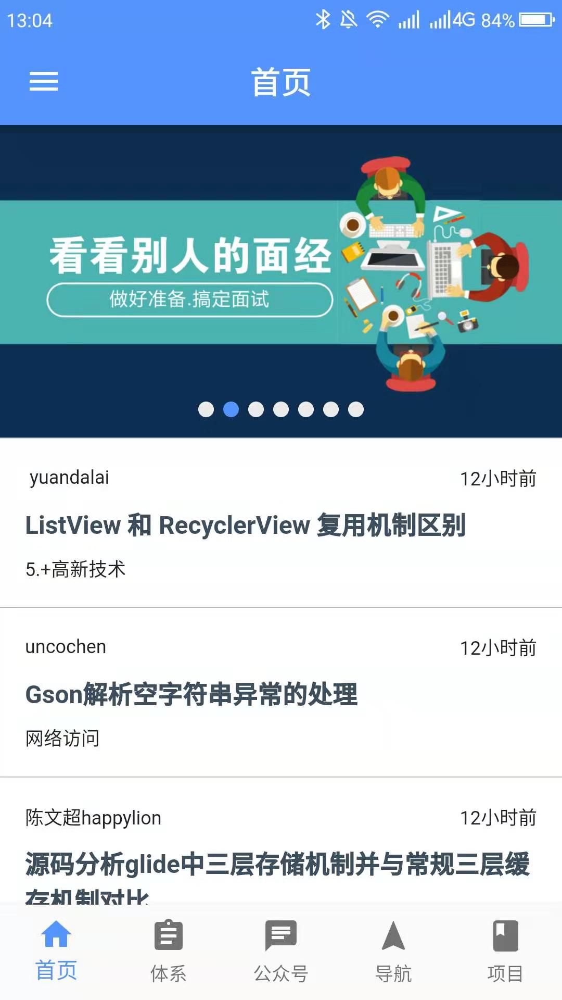
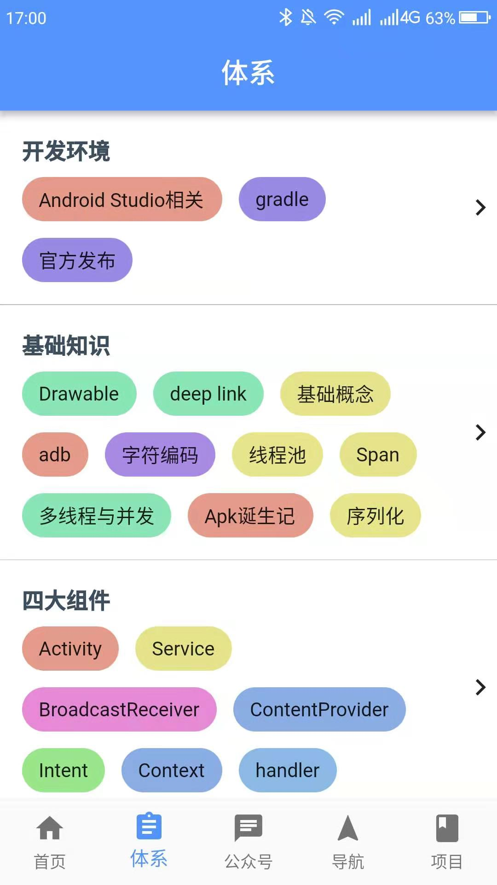
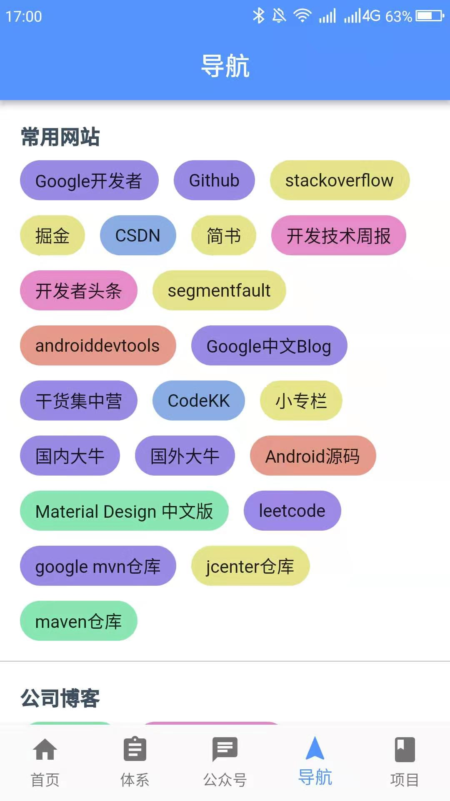
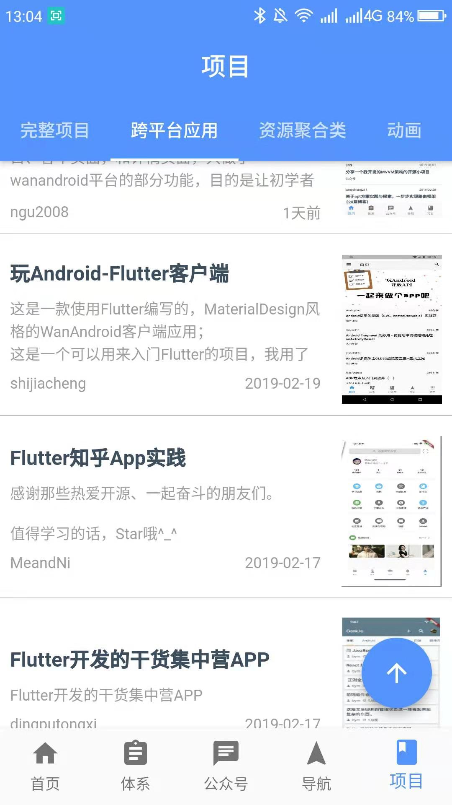
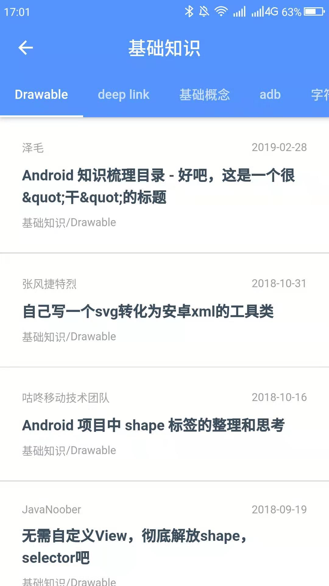

## 前言

- 这是一款使用Flutter写的WanAndroid客户端应用，在Android和IOS都完美运行
- 可以用来入门Flutter，简单明了，适合初学者
- [项目完全开源](https://github.com/ngu2008/wanandroid_ngu)，欢迎Star&Fork，有问题请提交Issues

## 功能介绍

- 项目首页、知识体系、公众号、导航、项目、各个页面，和详情页面，只做了wanandroid平台的部分功能，目的是让初学者能够快速入门

## 下载
- 扫描二维码下载

  

- 暂不支持IOS版本下载，请自行clone项目代码运行。

## 项目截图

     
|  |  |  |

## 感谢

1. 特别感谢github开源作者[shijiacheng](https://github.com/shijiacheng/wanandroid_flutter)
2. 感谢鸿洋大神及[玩Android官网](http://www.wanandroid.com/)提供的[开放API](http://www.wanandroid.com/blog/show/2)。

## 使用开源库

- [flutter_swiper](https://pub.flutter-io.cn/packages/flutter_swiper)

- [cupertino_icons](https://pub.flutter-io.cn/packages/cupertino_icons)

- [flutter_webview_plugin](https://pub.flutter-io.cn/packages/flutter_webview_plugin)

- [dio](https://pub.flutter-io.cn/packages/dio)